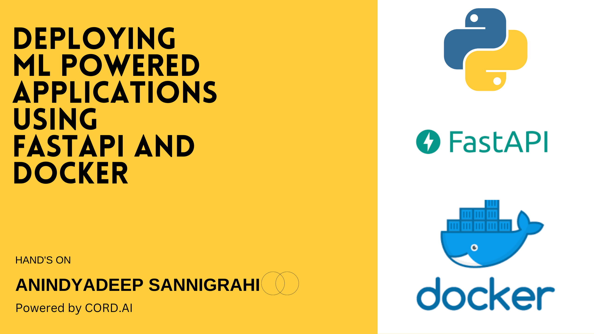

# **Deploy your ML model using FastAPI and docker**




This is the official repository for tutorial session [Deploying ML Powered applications using FastAPI and Docker](https://youtu.be/XYc5Klorf38). The session has been hosted by CORD AI [Website](https://cordai.org) |    [Twitter](https://twitter.com/CRforAi). 

### What does the tutorial teaches

In this tutorial, we are trying to understand how we move from the model experimentation and development lifecycle towards deploying models into productions as REST APIs. Not only that, how to package those models using docker so that it can be used and deployed acorss different platforms. 

Specifically, in this session, we have covered:

- Convert a initial simple business problem into an end / intermediate solution / service (REST APIs)
- Used jupyter-notebooks for basic data analysis and EDA. Also we have implemented models to see how it works on the provided data. 
- Created schemas for the Request bodies using Pydantic 
- Created a basic level of configuration management for the serving model deployement on different environments like prod/dev/stage. 
- Implemented model inference engine for model prediction. 
- Created a simple REST API for using FastAPI with `GET` and `POST` endpoints for model prediction

### How to run the existing project

#### **Method1** Running locally: 

- Clone the repository by running `git clone https://github.com/PyTorchFastAPISession.git` 
- First install the latest version of [PyTorch](https://pytorch.org/)
- Install the remaining dependencies from `requirements.txt` files. 
- Finally, once everything is installed, just run the command using:

```python3
PYTHONPATH=. python3 app/main.py
```
This will start our server.

#### **Method2** Running using docker: 

- Just like before, first clone the repository.
- Then just run the command

```bash
sh docker_build.sh
```
This will start building our docker image

- Once the image is built, run the command

```bash
docker run ml/session1:latest
```

#### **Comming soon:**

Some of the things that I will be doing in the future on this repository are:

- Creating a detailed blog/playlist for the same. The main motivation is to make folks understand about each and every thing and different best practices. 
- Using and integrating services like MlFlow, W&B for model registration. 
- Making a simple cloud native application on the top of it using K8s. 

---

Till then stay tuned. Also contributions are always welcome 🤗. You can create issues and build on the top of this app. The modelling prespective was never prioritized atleast for this case. But we can work around it. 
